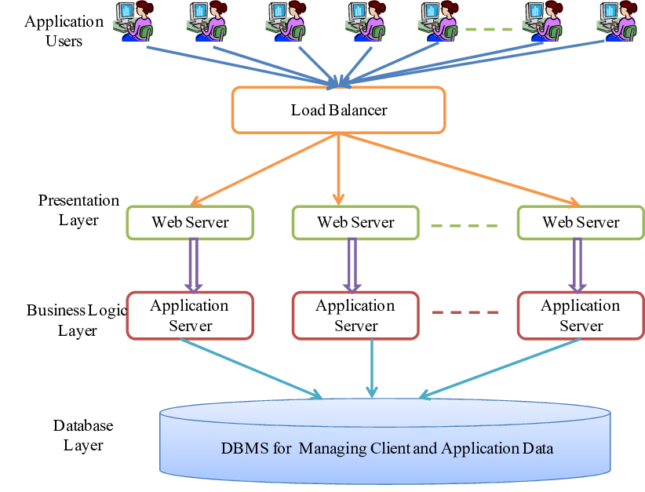

## 1. Yêu cầu

Chúng ta cần thiết kế một hệ thống Blog phục vụ cho một số lượng lớn người đọc **(trung bình 10.000 giao dịch/1 giây)**. Làm sao để có thể thiết kế hệ thống này?

<!--more-->
## 2. Phân tích yêu cầu
Ngày nay, mọi người ở Việt Nam nói riêng hay cả thế giới nói chung đều được tiếp xúc với thiết bị điện tử cũng như là các mạng xã hội, blog, web giải trí. Internet gần như đã phủ sóng khắp nơi trên thế giới. Từ đó, nhu cầu sử dụng và truy cập và các trang Web cũng gia tăng một cách chóng mặt. Vì thế, khi thiết kế các phần mềm, trang Web hiện nay, ngoải việc phải chinh chu trong các công đoạn UI, UX, chức năng, hệ thống còn cần phải đảm baỏ có thể hoạt động tốt trong môi trường `tải cao` **(high-load)**, tức nhiều người truy cập cùng một thời điểm.

Những vấn đề **khó khăn** mà hệ thống thường đối mặt khi tải-cao bao gồm:
+ Page tải chậm hoặc tải kéo dài vô tận, sập hệ thống (crashing)
+ Xảy ra lỗi ngẫu nhiên
+ Request của khách hàng bị chậm hoặc thất bại
+ Bị ngắt kết nối khỏi Web Server trong khi đang họat động
+ Page chỉ load lên được một vài phần (như chưa load xong tấm ảnh, logo,...)
+ Về phần cứng, ta có I/O problem, thời gian sửa lỗi tăng cao, CPU/RAM được sử dụng quá mức làm giảm tuổi thọ của máy và các phần cứng

Tất cả những điều trên sẽ làm giảm trải nghiệm của khách hàng đối với sản phẩm công nghệ của chúng ta, từ đó, chúng ta sẽ đánh mất đi những người khách hàng tiềm năng và mất đi một phần lợi nhuận. Chính vì thế, trong quá trình phát triên ứng dụng, khó khăn khi gặp tải cao trên phần cứng và phần mềm cần phải được giải quyết.

## 3. Giải pháp
### Các tiêu chí cho hệ thống high-load:
- Số lượng các request đồng thời trong giờ cao điểm thông qua các giao thức mạng: HTTP, HTTPs, TCP/IP, UDP, Socket,...
- Lưu lượng dữ liệu cần được xử lý trong Database.
- Số lượng thông tin truyền đi trong một request.
- Bảo vệ dữ liệu người dùng tránh bị thu âm hoặc đánh cắp. Bảo mật của hệ thống Web yêu cầu mức bảo vệ tối đa chống lại sự rò rỉ dữ liệu vào truy cập mở, ví dụ như các cuộc tấn công DDOS.

### Sử dụng cân bằng tải (Load balancer)

Cân bằng tải (**Load balancer**) có thể được mô tả là bộ phân phối lưu lượng truy cập có hệ thống từ một ứng dụng đến các máy chủ khác nhau. Do đó, một bộ cân bằng tải được chèn vào giữa các thiết bị **front-end** và các máy chủ **back-end**. Trong điện toán đám mây, cân bằng tải liên quan đến việc phân phối công việc cho một số tài nguyên máy tính. Cân bằng tải (bao gồm cả cân bằng tải điện toán đám mây) đảm bảo rằng công việc được phân phối hiệu quả. Các công nghệ cung cấp khả năng dự phòng, do đó, điều chỉnh tải mạng hoặc lưu lượng ngày càng tăng. *Ví dụ*: dữ liệu có thể được lấy từ một máy chủ bị quá tải để được phân phối lại cho các máy chủ có sẵn khác. Điều này cải thiện đáng kể hiệu quả của một hệ thống. 

### Mô hình đề xuất

<b>(Nguồn: Researchgate)</b>

Đây là mô hình đơn giản có thể giải quyết vấn đề tải cao. Ở phần giao diện **(Application Users)**, tức *Front-end*, người đọc Blog có thể sử dụng nhiều nền tảng khác nhau như *Web, Mobile*,.. Ở lớp ứng dụng của người dùng, lượng lớn các Request từ *10.000 người dùng* như mở một bài post mới, lưu bài post vào trong mục ưu thích,.. ta sẽ gửi chúng thông qua một chiếc **cân bằng tải** `(Load balancing)`. Nó là phần chính và rất quan trọng dùng để phân phối khối lượng công việc ra nhiều **Web Server** cùng một lúc, tránh gây *quá tải* cho một Web Server duy nhất. Chính vì điều này, hệ thống có thể cải thiện được hiệu suất, độ tin cậy của Website, ứng dụng chúng ta đang xây dựng. Sau khi phân chia các Request vào các Web Server, ta sẽ đưa chúng xuống layer kế tiếp **Applicaton Server**, đây chính là nơi ta sẽ xử lý các Request đó và tương tác trực tiếp với **Hệ Cơ sở dữ liệu** *(Database System)* ở bên dưới và đưa ngược các Respone lên.

Ngoài ra, trong tình huống thực tế, ta sẽ cần thêm **cân bằng tải dự phòng**, phòng khi bộ cân bằng tải chính gặp trục trặc. Cụ thể hơn, khi cân bằng chính bị lỗi, DNS sẽ tự động đưa người dùng đến với cân bằng tải dự phòng. Bộ dự phòng có thể kết hợp tạo thành 1 *cụm cân bằng tải*. Mỗi bộ cân bằng tải đều có thể tự phát hiện lỗi và phục hồi.

## 4. Tài liệu tham khảo
- https://www.linkedin.com/pulse/high-load-system-development-what-does-mean-pnn-soft
- https://dev.to/dianamaltseva8/how-to-build-an-architecture-that-will-handle-high-loads-cp0
- https://theappsolutions.com/blog/development/high-load-systems/#contents_12
- https://www.researchgate.net/figure/High-level-architecture-of-a-multi-layered-enterprise-application-consisting-of-clients_fig1_223130135
- https://viettelidc.com.vn/tin-tuc/can-bang-tai-load-balancing-la-gi-va-tai-sao-phai-dung-can-bang-tai

   
 

Best Regards,  

**Quách Minh Tuấn**

